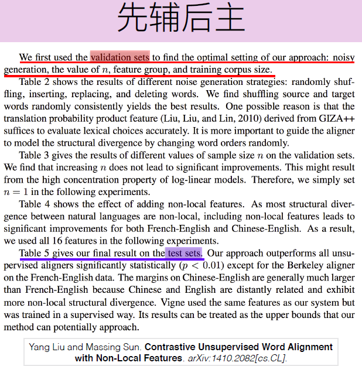

# how to write Result Analysis

- 纵向：输入，特征，模型，算法
- 横向：不同领域的数据集 （1）说明模型的可迁移性，（2）说明数据集间的差异对性能的影响 
- 和其他论文的比较 （1）方法类别不一样 （2）使用了额外的数据

## 如何写论文（刘洋）

## Lan, Man

- Case 1: A 比 B 好

> [A] outperforms [B]. INFERENCE.

> [A] performs better than [B]. INFERENCE.

> No matther [what kind of word representation is taken], [A] achieves substantially higher performance over [B]. INFERENCE.

> INFERENCE: This demonstrates the importance of ... 

> INFERENCE: It/Which proves that ... / the effective of [A] in doing ...

> INFERENCE: Which indicates that [A] does help to do ...

> INFERENCE: This is because ...

- Case 2: A + B 更好

> the integration of [A] and [B] performs better than any of the [A \cap B]. INFERENCE.

> INFERENCE: That is, [A] is able to do ... and [B] takes the ... into consideration, which is crucial to ... 

## Wang,Jin'gang

- Case 1: A 比 B 差

> [A] cannot beat [B]. 

> 
